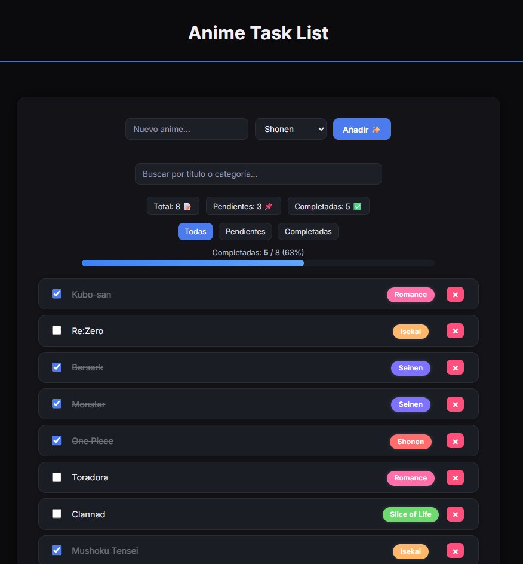

## Demo

https://animetasklist.web.app

# Anime Task List

Anime Task List es una aplicación web hecha con Angular para gestionar tareas, pero con un toque temático de anime.

Nació como un proyecto personal para practicar Angular moderno, organizar mejor mi código y ganar confianza como desarrollador frontend.

## Qué hace la aplicación

- Permite añadir tareas indicando el título y su categoría (Shonen, Seinen, Isekai, Romance, etc.).

- Se pueden marcar como completadas o pendientes con un simple clic.

- Incluye filtros por estado (todas, pendientes, completadas).

- Tiene un buscador para filtrar por texto o categoría.

- Muestra una barra de progreso con el porcentaje de tareas completadas.

- Todo se guarda en el almacenamiento local del navegador, así que los datos no se pierden al recargar la página.

- La interfaz está diseñada en modo oscuro, con un estilo limpio y centrado en la legibilidad.

## Tecnologías utilizadas

- Angular con componentes standalone.

- Signals para manejar el estado de las tareas de forma reactiva.

- Reactive Forms para el formulario de creación de tareas.

- TypeScript para tener el código más claro y tipado.

- HTML y CSS para la estructura y el diseño.

- LocalStorage para guardar las tareas en el navegador sin necesitar backend.

## Cómo ejecutar el proyecto

Clona el repositorio:

git clone https://github.com/Deeckline/anime-task-list
cd anime-task-list
npm install

Lanza la aplicación:

ng serve -o

La app estará disponible en:

http://localhost:4200

Estructura del proyecto
src/
┣ app/
┃ ┣ components/
┃ ┃ ┣ add-task/
┃ ┃ ┃ ┣ add-task.component.ts
┃ ┃ ┃ ┣ add-task.component.html
┃ ┃ ┃ ┗ add-task.component.css
┃ ┃ ┗ task-list/
┃ ┃ ┣ task-list.component.ts
┃ ┃ ┣ task-list.component.html
┃ ┃ ┗ task-list.component.css
┃ ┣ services/
┃ ┃ ┗ todo.service.ts
┃ ┣ app.component.ts
┃ ┣ app.component.html
┃ ┗ app.component.css
┣ assets/
┣ index.html
┗ main.ts

## Captura de pantalla

## Lo que aprendí haciéndola

- Usar Signals para mantener el estado sincronizado sin depender de RxJS.

- Estructurar componentes standalone de forma clara y sencilla.

- Validar formularios de manera reactiva.

- Usar LocalStorage para persistir datos entre recargas.

- Diseñar una interfaz en modo oscuro legible y agradable.

- Iterar el diseño: empezar simple y mejorarlo progresivamente.

- Depurar errores, entenderlos y corregirlos limpiamente.

## Próximos pasos

- Guardar la configuración de filtros y vista entre sesiones.

- Permitir ordenar las tareas (por estado, categoría o alfabéticamente).

- Integrar una API pública de anime para sugerir títulos reales.

- Añadir tests básicos para el servicio y los componentes.

## Sobre mí

Soy Rubén Alegre, desarrollador junior especializado en Angular.
Sigo formándome cada día con proyectos prácticos y mi objetivo es entrar en un equipo donde pueda crecer como frontend.

📧 ruben.alegre.dev@gmail.com

🔗 LinkedIn - https://www.linkedin.com/in/ruben-alegre/

## Portfolio

Puedes ver más proyectos y conocer mejor mi perfil en:

🔗 https://ruben-alegre-portfolio.web.app/

> “La mejor forma de aprender a programar es construir cosas, romperlas y volver a hacerlas mejor.”
